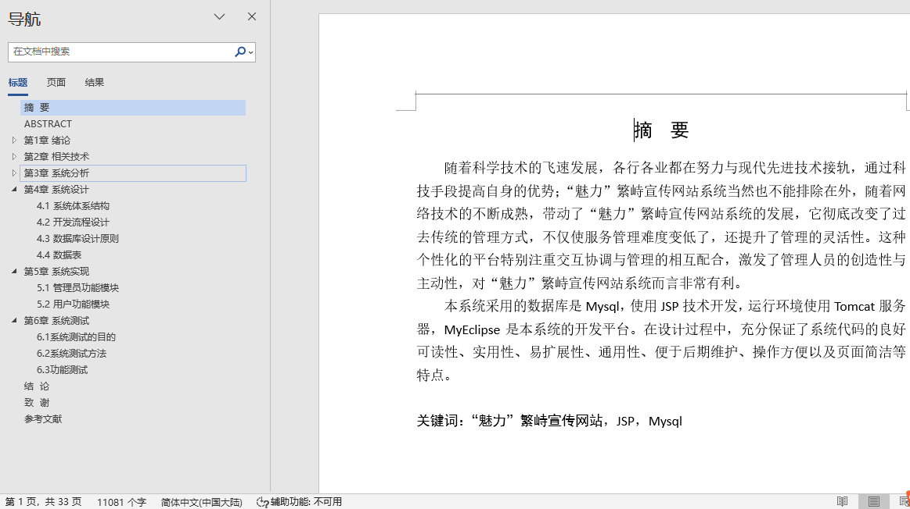
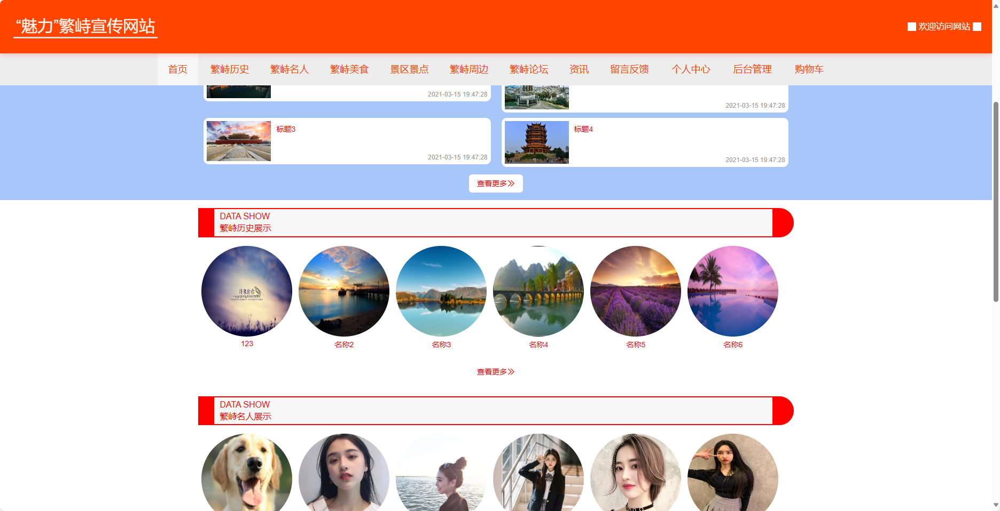
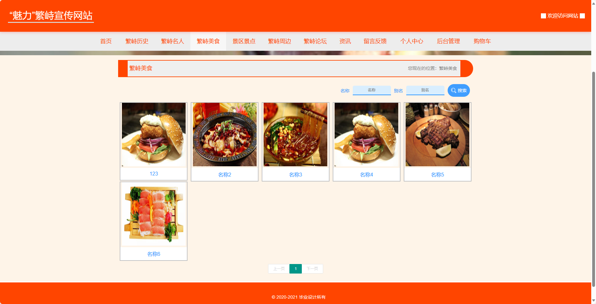
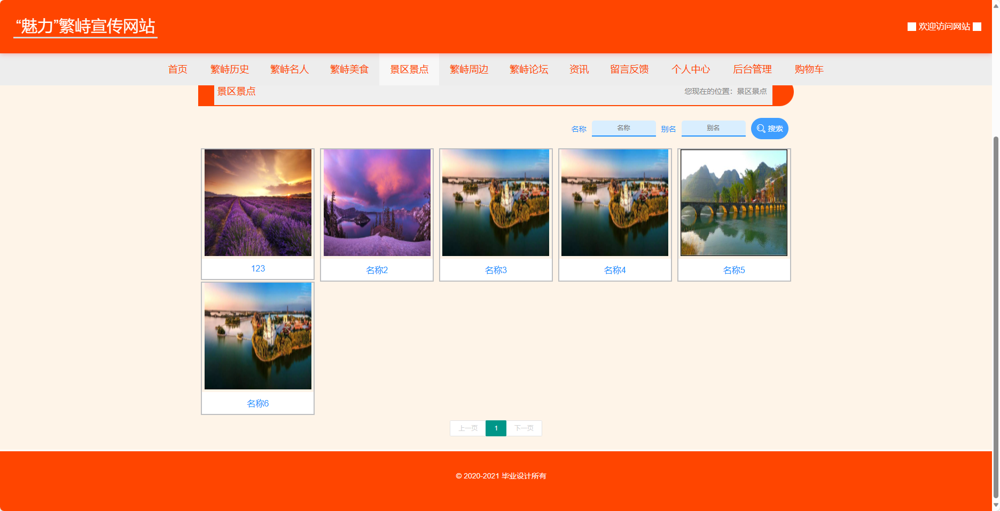
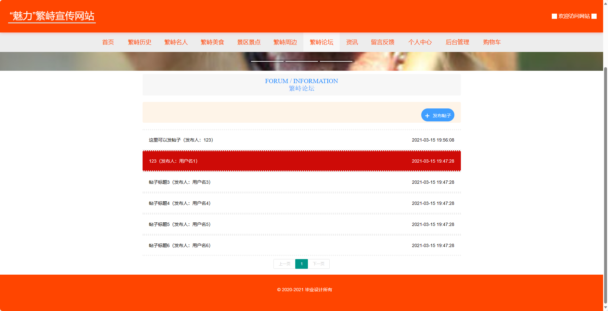
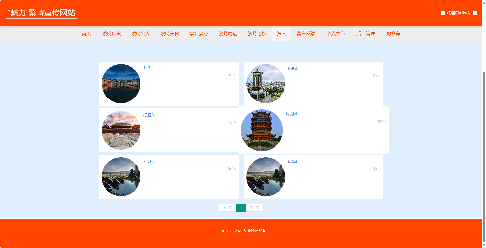
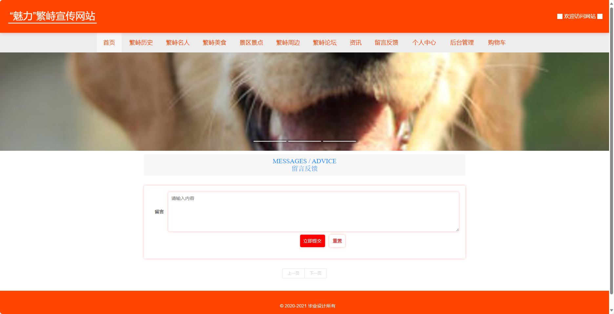
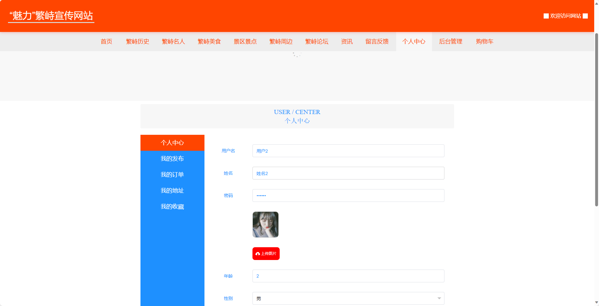
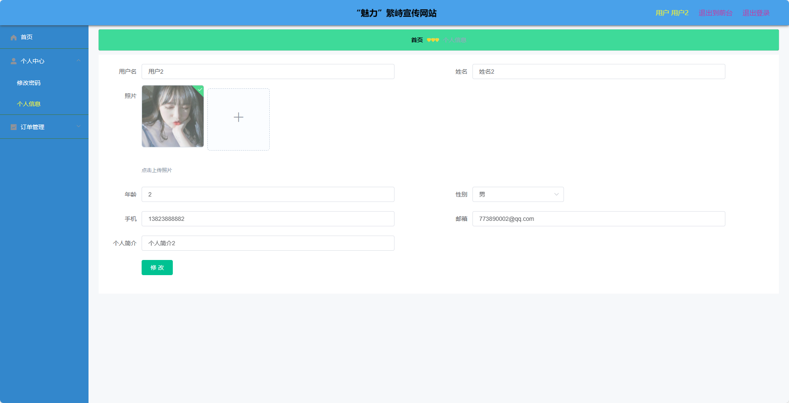

## 基于SSM框架实现的“魅力”繁峙宣传网站(程序+报告)

- <b>完整代码获取地址：从戎源码网 ([https://armycodes.com/](https://armycodes.com/))</b>
- <b>技术探讨、资料分享，请加QQ群：692619798</b> 
- <b>作者微信：19941326836  QQ：952045282</b> 
- <b>承接计算机毕业设计、Java毕业设计、Python毕业设计、深度学习、机器学习</b>
- <b>选题+开题报告+任务书+程序定制+安装调试+论文+答辩ppt 一条龙服务</b>
- <b>所有选题地址 ([https://github.com/YuLin-Coder/AllProjectCatalog](https://github.com/YuLin-Coder/AllProjectCatalog)) </b>

## 项目介绍
基于SSM框架实现的“魅力”繁峙宣传网站，系统包含两种角色：管理员、用户,系统分为前台和后台两大模块，主要功能如下。

前台：
1. 首页：展示“魅力”繁峙宣传网站的主要内容和推荐信息，包括繁峙的特色、旅游景点、美食等，吸引用户浏览和了解繁峙。
2. 繁峙历史：介绍繁峙的历史沿革、文化传承和重要事件，帮助用户了解繁峙的历史背景。
3. 繁峙名人：介绍繁峙出产的名人和有影响力的人物，包括艺术家、学者、企业家等，突显繁峙的人文底蕴。
4. 繁峙美食：展示繁峙的传统美食和特色菜品，包括菜品的介绍、图片、口味特点等，吸引用户品尝和探索繁峙的美食文化。
5. 景区景点：介绍繁峙的自然景观和旅游景点，包括山水风光、历史遗迹等，为用户提供游览繁峙的参考和指南。
6. 繁峙周边：推荐繁峙周边的景点和旅游资源，包括周边城市、风景名胜等，为用户提供更广泛的旅游选择。
7. 繁峙论坛：提供用户交流和分享的平台，用户可以在论坛中发布话题、发表观点，与其他用户进行互动和讨论。
8. 资讯：提供繁峙宣传网站的最新资讯和动态，包括繁峙的新闻、活动等，帮助用户了解繁峙的最新动态。
9. 留言反馈：用户可以在留言板上留下对繁峙的意见、建议或表达对繁峙的喜爱，提供反馈和互动的平台。
10. 个人中心：用户可以管理个人信息、修改密码、查看订单等，方便用户管理和维护个人资料。
11. 购物车：用户可以将感兴趣的商品加入购物车，方便统一管理和结算购物车中的商品。

后台-用户：
1. 个人中心：提供用户个人信息管理、密码修改等功能。
2. 订单管理：用户可以查看自己的订单信息，包括订单状态、支付情况等，并提供取消订单、确认收货等操作。

后台-管理员：
1. 个人中心：提供管理员个人信息管理、权限管理等功能。
2. 用户管理：管理系统中的用户信息，包括用户的添加、编辑、删除等操作。
3. 繁峙历史管理：管理繁峙历史的相关内容，包括内容的添加、编辑、删除等操作。
4. 繁峙名人管理：管理繁峙名人的相关信息，包括名人的添加、编辑、删除等操作。
5. 繁峙美食管理：管理繁峙美食的相关信息，包括美食的添加、编辑、删除等操作。
6. 景区景点管理：管理繁峙的景区景点信息，包括景点的添加、编辑、删除等操作。
7. 繁峙周边管理：管理繁峙周边的旅游资源信息，包括资源的添加、编辑、删除等操作。
8. 留言板管理：管理用户在留言板上的留言和反馈信息，包括留言的查看、回复、删除等操作。
9. 繁峙论坛：管理繁峙论坛的帖子和用户，包括帖子的查看、删除、用户的管理等操作。
10. 我的收藏管理：管理用户的收藏信息，包括收藏的查看、删除等操作。
11. 管理员管理：管理系统中的管理员账号，包括管理员的添加、编辑、删除等操作。
12. 系统管理：管理网站的基本配置信息，包括网站名称、Logo、版权信息等。
13. 订单管理：管理用户的订单信息，包括订单的查看、处理等操作。

## 项目技术
- 编程语言：Java
- 数据库：MySQL
- 前端技术：JSP、HTML、Jquery、Bootstrap
- 后端技术：Spring、SpringMVC、MyBatis

## 运行环境
- JDK版本：JDK1.8及以上
- 开发工具：IDEA、Ecplise、Myecplise都可以
- 数据库: MySQL5.7及以上

## 运行截图

